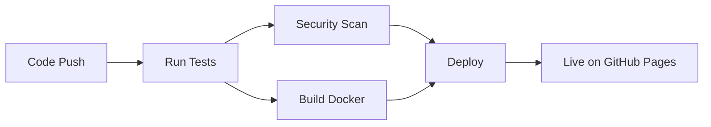

# 🎮 Wordle Game with Automated CI/CD Pipeline


A production-ready web application featuring an interactive Wordle game, deployed through a fully automated CI/CD pipeline using GitHub Actions.

## 🌐 Live Demo

**Play the game:** https://friesknight.github.io/wordle-automated-deployment

## 📋 Table of Contents

- [Overview](#overview)
- [Features](#features)
- [Architecture](#architecture)
- [CI/CD Pipeline](#cicd-pipeline)
- [Technologies](#technologies)
- [Getting Started](#getting-started)
- [Development](#development)
- [Deployment](#deployment)
- [Testing](#testing)
- [Future Enhancements](#future-enhancements)
- [Contributing](#contributing)
- [License](#license)

---

## 🎯 Overview

This project demonstrates modern DevOps practices by combining an interactive web application with a fully automated CI/CD pipeline. Every code push triggers automated testing, security scanning, Docker containerization, and deployment to production.

### What Makes This Project Unique

- ✅ **Full CI/CD Automation** - From commit to production in under 3 minutes
- ✅ **Production-Grade Pipeline** - Includes testing, security scanning, and containerization
- ✅ **Interactive Web App** - Engaging Wordle game showcasing frontend skills
- ✅ **Infrastructure as Code** - Entire pipeline defined in version-controlled YAML
- ✅ **Zero-Downtime Deployment** - Automated deployment to GitHub Pages

---

## ✨ Features

### Game Features

- 🎮 Classic Wordle gameplay - Guess the 5-letter word in 6 tries
- 🎨 Smooth animations and visual feedback
- 📊 Statistics tracking (games played, win rate, current streak)
- 💾 Local storage for persistent stats
- ⌨️ Physical and on-screen keyboard support
- 📱 Fully responsive design (mobile-friendly)
- 🎯 40+ word vocabulary

### DevOps Features

- 🔄 Automated testing on every commit
- 🔒 Security vulnerability scanning with Trivy
- 🐳 Docker containerization and testing
- 🚀 Automatic deployment to GitHub Pages
- 📊 Build status badges and reporting
- ⚡ Parallel job execution for speed
- 📝 Comprehensive pipeline summaries

---

## 🏗️ Architecture

### System Architecture

```
┌─────────────────────────────────────────────────────────────┐
│                     Developer Workflow                       │
└─────────────────────────────────────────────────────────────┘
                              │
                              ├─ git push
                              ↓
┌─────────────────────────────────────────────────────────────┐
│                    GitHub Actions Pipeline                   │
│                                                              │
│  ┌──────────┐    ┌──────────┐    ┌──────────┐             │
│  │   Test   │───→│ Security │───→│  Build   │             │
│  │  Stage   │    │   Scan   │    │  Docker  │             │
│  └──────────┘    └──────────┘    └──────────┘             │
│       │                                 │                   │
│       └─────────────┬───────────────────┘                   │
│                     ↓                                       │
│              ┌──────────┐                                   │
│              │  Deploy  │                                   │
│              │  to Prod │                                   │
│              └──────────┘                                   │
└─────────────────────────────────────────────────────────────┘
                              │
                              ↓
                    ┌──────────────────┐
                    │  GitHub Pages    │
                    │  (Production)    │
                    └──────────────────┘
                              │
                              ↓
                    ┌──────────────────┐
                    │   End Users      │
                    │  (Players)       │
                    └──────────────────┘
```

### Pipeline Stages



---

## 🔄 CI/CD Pipeline

### Pipeline Overview

The CI/CD pipeline automatically executes on every push to `main` or `develop` branches:

```yaml
Trigger: git push
    ↓
┌─── Stage 1: Run Tests (18s) ───────────────┐
│ • Checkout code                             │
│ • Setup Node.js environment                 │
│ • Install dependencies                      │
│ • Execute unit tests                        │
│ • Generate coverage reports                 │
└─────────────────────────────────────────────┘
    ↓
┌─── Stage 2: Security Scan (23s) ───────────┐
│ • Checkout code                             │
│ • Run Trivy vulnerability scanner           │
│ • Scan for CVEs and misconfigurations       │
│ • Generate security report                  │
└─────────────────────────────────────────────┘
    ↓
┌─── Stage 3: Build Docker Image (36s) ──────┐
│ • Checkout code                             │
│ • Setup Docker Buildx                       │
│ • Build container image                     │
│ • Test container health                     │
│ • Cache layers for future builds            │
└─────────────────────────────────────────────┘
    ↓
┌─── Stage 4: Deploy to Production (51s) ────┐
│ • Checkout code                             │
│ • Configure GitHub Pages                    │
│ • Upload application artifacts              │
│ • Deploy to production                      │
│ • Generate deployment summary               │
└─────────────────────────────────────────────┘
    ↓
┌─── Stage 5: Pipeline Summary (3s) ─────────┐
│ • Collect all stage results                 │
│ • Generate comprehensive report             │
│ • Update build status badges                │
└─────────────────────────────────────────────┘

Total Pipeline Duration: ~2 minutes 30 seconds
```

### Pipeline Configuration

The pipeline is defined in `.github/workflows/ci-cd-pipeline.yml`:

**Key Features:**

- **Parallel Execution**: Test and Security Scan run in parallel
- **Dependency Management**: Build stage waits for Test + Security
- **Conditional Deployment**: Only deploys from `main` branch
- **Artifact Storage**: Test coverage reports retained for 30 days
- **Failure Handling**: Pipeline stops on any stage failure

### Pipeline Jobs Breakdown

#### 1. Test Job

```yaml
Purpose: Validate code quality and functionality
Duration: ~18 seconds
Actions:
  - Install dependencies
  - Run Mocha test suite
  - Generate NYC coverage report
  - Upload coverage artifacts
```

#### 2. Security Scan Job

```yaml
Purpose: Identify security vulnerabilities
Duration: ~23 seconds
Tool: Trivy (Aqua Security)
Scans:
  - Dependencies for known CVEs
  - Configuration issues
  - Exposed secrets
  - License compliance
```

#### 3. Build Docker Image Job

```yaml
Purpose: Containerize application
Duration: ~36 seconds
Process:
  - Build multi-stage Docker image
  - Run container health checks
  - Test image functionality
  - Cache layers with GitHub Actions cache
```

#### 4. Deploy to GitHub Pages Job

```yaml
Purpose: Deploy to production
Duration: ~51 seconds
Requirements:
  - Only runs on main branch
  - Requires Test + Build to pass
Permissions:
  - contents: read
  - pages: write
  - id-token: write
```

---

## 🛠️ Technologies

### Frontend

- **HTML5** - Semantic markup
- **CSS3** - Animations, Flexbox, Grid, Custom Properties
- **JavaScript (ES6+)** - Game logic, DOM manipulation, Local Storage API

### Testing

- **Mocha** - Test framework
- **NYC** - Code coverage reporting

### DevOps & Infrastructure

- **GitHub Actions** - CI/CD orchestration
- **Docker** - Containerization
- **Nginx** - Web server (in container)
- **Trivy** - Security scanning
- **GitHub Pages** - Static site hosting

### Development Tools

- **Git** - Version control
- **npm** - Package management
- **YAML** - Pipeline configuration

---

## 🚀 Getting Started

### Prerequisites

- **Node.js** 18.x or higher
- **npm** 9.x or higher
- **Git** 2.x or higher
- **Docker** (optional, for containerized testing)

### Installation

1. **Clone the repository**

   ```bash
   git clone https://github.com/FriesKnight/devops-cicd-pipeline-demo.git
   cd devops-cicd-pipeline-demo
   ```

2. **Install dependencies**

   ```bash
   npm install
   ```

3. **Run the application locally**

   ```bash
   # Open index.html in your browser
   # Or use a simple HTTP server:
   npx http-server . -p 8080
   ```

4. **Access the application**
   ```
   http://localhost:8080
   ```

---

## 💻 Development

### Project Structure

```
devops-cicd-pipeline-demo/
├── .github/
│   └── workflows/
│       └── ci-cd-pipeline.yml    # CI/CD pipeline configuration
├── tests/
│   └── app.test.js               # Mocha test suite
├── screenshots/                   # Project screenshots
├── Dockerfile                     # Container configuration
├── index.html                     # Main application file
├── package.json                   # Node.js dependencies
├── package-lock.json              # Dependency lock file
├── .gitignore                     # Git ignore rules
└── README.md                      # This file
```

### Running Tests Locally

```bash
# Run all tests
npm test

# Run tests with coverage
npm run test:coverage

# Watch mode (if configured)
npm run test:watch
```

### Docker Development

```bash
# Build the Docker image
docker build -t wordle-game .

# Run the container
docker run -d -p 8080:80 wordle-game

# Access the application
open http://localhost:8080

# View container logs
docker logs <container-id>

# Stop the container
docker stop <container-id>
```

### Making Changes

1. **Create a new branch**

   ```bash
   git checkout -b feature/your-feature-name
   ```

2. **Make your changes**

   - Edit code
   - Add tests
   - Update documentation

3. **Test locally**

   ```bash
   npm test
   ```

4. **Commit and push**

   ```bash
   git add .
   git commit -m "feat: add your feature description"
   git push origin feature/your-feature-name
   ```

5. **Create Pull Request**
   - Pipeline will run automatically
   - Review test results
   - Merge when approved

### Code Style Guidelines

- **JavaScript**: ES6+ syntax, camelCase naming
- **HTML**: Semantic tags, proper indentation
- **CSS**: BEM methodology preferred
- **Commits**: Follow Conventional Commits specification

---

## 🚢 Deployment

### Automatic Deployment

The application automatically deploys when code is pushed to the `main` branch:

1. Push code to `main` branch
2. GitHub Actions pipeline executes
3. All tests and security scans pass
4. Docker image is built and tested
5. Application deploys to GitHub Pages
6. Live site updates within 2-3 minutes

### Manual Deployment

To manually trigger deployment:

1. Go to **Actions** tab in GitHub
2. Select **CI/CD Pipeline** workflow
3. Click **Run workflow**
4. Select branch and confirm

### Deployment Environments

- **Production**: `main` branch → [https://friesknight.github.io/devops-cicd-pipeline-demo/](https://friesknight.github.io/devops-cicd-pipeline-demo/)
- **Development**: `develop` branch → Pipeline runs but doesn't deploy

### Rollback Procedure

If you need to rollback to a previous version:

1. **Find the commit hash** of the working version:

   ```bash
   git log --oneline
   ```

2. **Revert to that commit**:

   ```bash
   git revert <commit-hash>
   git push origin main
   ```

3. **Or force push** (use with caution):
   ```bash
   git reset --hard <commit-hash>
   git push origin main --force
   ```

---

## 🧪 Testing

### Test Suite

The project includes a comprehensive test suite covering:

- Game logic validation
- String operations
- Array manipulation
- Math operations
- Environment validation

### Running Tests

```bash
# Run all tests
npm test

# Run with coverage report
npm run test:coverage

# Coverage report will be in coverage/ directory
open coverage/index.html
```

### Test Coverage Goals

- **Overall Coverage**: >80%
- **Critical Functions**: 100%
- **Edge Cases**: Thoroughly tested

### Adding New Tests

Create new test files in the `tests/` directory:

```javascript
// tests/new-feature.test.js
const assert = require("assert");

describe("New Feature", function () {
  it("should work correctly", function () {
    // Your test here
    assert.strictEqual(1 + 1, 2);
  });
});
```

---

## 🔮 Future Enhancements

### Planned Features

#### Phase 1: Backend Integration

- [ ] Node.js + Express backend
- [ ] PostgreSQL database
- [ ] User authentication (JWT)
- [ ] RESTful API endpoints

#### Phase 2: Multiplayer Mode

- [ ] WebSocket integration (Socket.io)
- [ ] Real-time gameplay
- [ ] Room-based matchmaking
- [ ] Spectator mode

#### Phase 3: Enhanced Features

- [ ] Global leaderboard
- [ ] User profiles and statistics
- [ ] Friend system
- [ ] Daily challenges
- [ ] Achievement system
- [ ] Custom word lists
- [ ] Difficulty levels

#### Phase 4: Advanced DevOps

- [ ] Kubernetes deployment
- [ ] Terraform infrastructure
- [ ] Monitoring with Prometheus/Grafana
- [ ] Log aggregation with ELK stack
- [ ] A/B testing framework
- [ ] Performance monitoring

### Architecture for Multiplayer

```
Frontend (Current)
    ↓ WebSocket
Backend (Node.js + Socket.io)
    ↓
PostgreSQL Database
    ↓
Redis Cache
```

See `docs/ARCHITECTURE.md` for detailed expansion plans.

---

## 🤝 Contributing

Contributions are welcome! Here's how you can help:

### Reporting Issues

1. Check existing issues first
2. Use issue templates
3. Provide detailed reproduction steps
4. Include screenshots if applicable

### Submitting Pull Requests

1. **Fork the repository**
2. **Create a feature branch**
   ```bash
   git checkout -b feature/amazing-feature
   ```
3. **Make your changes**
4. **Add tests** for new functionality
5. **Ensure tests pass**
   ```bash
   npm test
   ```
6. **Commit your changes**
   ```bash
   git commit -m "feat: add amazing feature"
   ```
7. **Push to your fork**
   ```bash
   git push origin feature/amazing-feature
   ```
8. **Open a Pull Request**

### Commit Message Guidelines

Follow [Conventional Commits](https://www.conventionalcommits.org/):

- `feat:` New feature
- `fix:` Bug fix
- `docs:` Documentation changes
- `style:` Code style changes (formatting)
- `refactor:` Code refactoring
- `test:` Adding tests
- `chore:` Maintenance tasks

**Example:**

```
feat: add multiplayer matchmaking system

- Implement room-based matchmaking
- Add WebSocket connection handling
- Update UI for opponent tracking

Closes #123
```

---

## 📊 Performance Metrics

### Pipeline Performance

- **Average Build Time**: 2 minutes 30 seconds
- **Test Execution**: <20 seconds
- **Docker Build**: <40 seconds
- **Deployment**: <1 minute

### Application Performance

- **First Contentful Paint**: <1s
- **Time to Interactive**: <1.5s
- **Lighthouse Score**: 95+

---

## 🔒 Security

### Security Measures

- ✅ Automated vulnerability scanning with Trivy
- ✅ No sensitive data in repository
- ✅ Dependencies regularly updated
- ✅ HTTPS-only deployment
- ✅ Content Security Policy headers

### Reporting Security Issues

Please report security vulnerabilities to: [jonathan_juining@airdroitech.com]

---

## 📝 License

This project is licensed under the MIT License - see the [LICENSE](LICENSE) file for details.

---

## 👤 Author

**Jonathan Juining**

- Software Engineer @ AirdroiTech
- Certified Kubernetes Administrator (CKA)
- LinkedIn: [Jonathan Juining](https://www.linkedin.com/in/jonathan-juining-airdroitech/)
- GitHub: [@FriesKnight](https://github.com/FriesKnight)
- Email: jonathan_juining@airdroitech.com

---

## 🙏 Acknowledgments

- Game inspired by [Wordle](https://www.nytimes.com/games/wordle/index.html) by Josh Wardle
- CI/CD patterns from industry best practices
- Security scanning powered by [Aqua Security Trivy](https://github.com/aquasecurity/trivy)
- Hosted on [GitHub Pages](https://pages.github.com/)

---

## 📚 Additional Resources

- [GitHub Actions Documentation](https://docs.github.com/en/actions)
- [Docker Best Practices](https://docs.docker.com/develop/dev-best-practices/)
- [Mocha Testing Framework](https://mochajs.org/)
- [Trivy Security Scanner](https://aquasecurity.github.io/trivy/)

---

<div align="center">

### ⭐ Star this repo if you found it helpful!

**Built with ❤️ to demonstrate modern DevOps practices**

[Report Bug](https://github.com/FriesKnight/devops-cicd-pipeline-demo/issues) · [Request Feature](https://github.com/FriesKnight/devops-cicd-pipeline-demo/issues) · [View Demo](https://friesknight.github.io/devops-cicd-pipeline-demo/)

</div>
# Deployment with secrets configured

